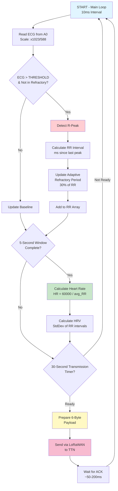
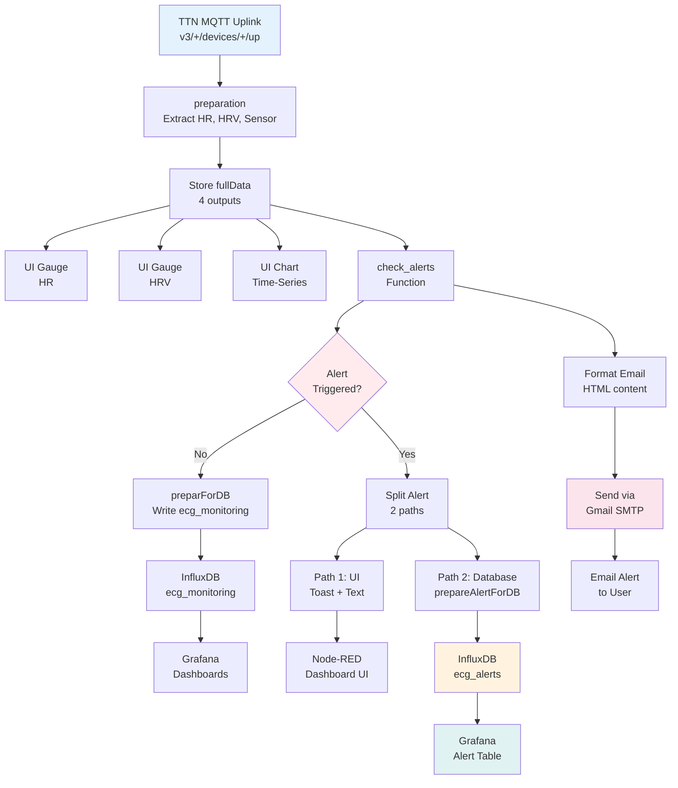
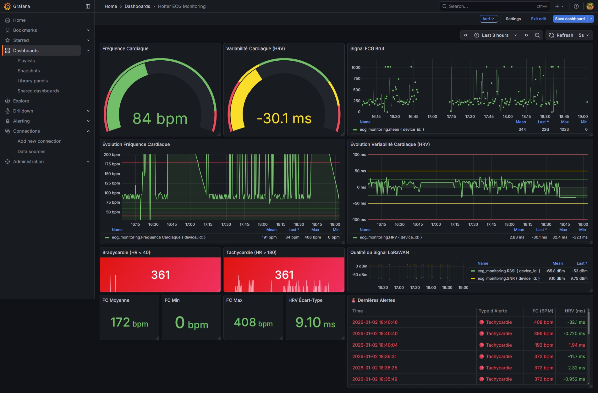
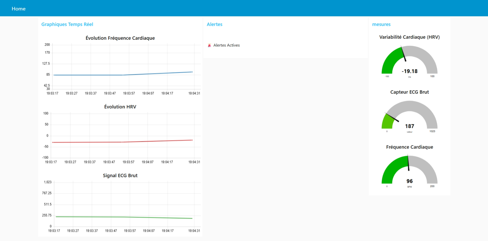

# Connected Holter - ECG Monitoring System

A complete IoT solution for real-time ECG monitoring with LoRaWAN connectivity, comprehensive alert system, and medical-grade dashboard. This project acquires ECG signals from an AD8232 sensor, detects cardiac anomalies, and visualizes data in real-time with Grafana.

## Project Overview

### System Architecture

```
Arduino Leonardo (ECG Acquisition)
        ↓
LoRaWAN Module (RFM95)
        ↓
The Things Network (TTN)
        ↓
MQTT / Node-RED (Data Processing)
        ↓
InfluxDB (Time-Series Storage)
        ↓
Grafana (Medical Dashboard)
```

### Main Loop Flowchart



### Node-RED Alert Processing



### Dashboard Screenshots

#### Grafana Dashboard



#### Node-RED Flow



## Key Features

- **Real-time ECG Acquisition**: 100 Hz sampling from AD8232 sensor on Arduino Leonardo
- **R-Peak Detection**: Adaptive threshold algorithm with dynamic refractory period (30% of RR interval, 150-600ms)
- **Heart Rate Calculation**: 5-second window averaging with RR interval tracking
- **HRV Analysis**: Heart Rate Variability computed from RR interval deviations
- **4-Level Alert System**: Bradycardia (<40 BPM), Tachycardia (>180 BPM), abnormal HRV (±100ms), sensor errors
- **LoRaWAN Transmission**: 30-second interval with 6-byte optimized payload
- **Email Notifications**: HTML-formatted alerts via Gmail SMTP
- **Medical Dashboard**: 14-panel Grafana dashboard with real-time gauges, charts, and alert history

## Hardware Components

| Component       | Specification                          |
| --------------- | -------------------------------------- |
| Microcontroller | Arduino Leonardo                       |
| ECG Sensor      | AD8232 (connected to A0)               |
| LoRaWAN Module  | RFM95 (Serial1 @ 57600 baud)           |
| Sampling Rate   | 100 Hz (10ms loop)                     |
| ADC Resolution  | Hardware max 588 (vs theoretical 1023) |

## Source Code Structure

### [src/IoT.ino](src/IoT.ino) - Main Firmware (~430 lines)

**Signal Processing**:

- `readECG()`: Acquires raw sensor values with hardware voltage scaling (588 max)
- `threshold = 300`: Detects R-peaks against calibrated baseline
- Adaptive refractory period: `30% × previous_RR_interval` (bounded 150-600ms)

**Cardiac Calculations**:

- `heartRate`: Calculated from RR intervals within 5-second window
- `hrv`: Standard deviation of RR intervals in milliseconds
- Transmission blocking compensation for LoRaWAN duty cycle

**Key Constants**:

```cpp
#define HARDWARE_MAX_READING 588        // Raspberry Pi DAC limitation
#define SAMPLING_INTERVAL 10            // 10ms = 100Hz
#define TRANSMISSION_INTERVAL 30000     // 30 seconds
#define THRESHOLD 300                   // R-peak detection baseline
#define HR_WINDOW_SIZE 5000             // 5 second averaging window
```

**LoRaWAN Payload** (6 bytes):

```
Bytes [0-1]: raw_sensor (0-1023)
Bytes [2-3]: heart_rate × 10 (0-2000)
Bytes [4-5]: hrv × 1000 (-100 to +100 ms)
```

### [node-red.json](node-red.json) - Data Pipeline (547 lines)

**Flow Components**:

1. **MQTT Input** (`preparation` function):

   - Subscribes to TTN uplink: `v3/+/devices/+/up`
   - Decodes payload using TTN decoder
   - Extracts HR, HRV, raw_sensor values
   - Stores complete data in `msg.fullData`

2. **Alert Detection** (`check_alerts` function):

   - Monitors 4 conditions:
     - HR < 40 (Bradycardia) 🔶
     - HR > 180 (Tachycardia) 🔴
     - |HRV| > 100ms (Abnormal HRV) ⚠️
     - Sensor out of range (Sensor Error) ❌
   - Outputs to 2 channels: UI display + database storage

3. **Alert Storage** (`prepareAlertForDB` function):

   - Formats alerts with tags (alert_type, device_id, alert_name)
   - Fields (heart_rate, hrv)
   - Writes to InfluxDB `ecg_alerts` measurement

4. **Email Notifications** (`Format Email` function):

   - Triggers when alerts detected
   - Sends HTML-formatted emails via Gmail SMTP
   - Includes timestamp, device ID, alert details, and current vitals

5. **Data Visualization**:
   - Gauges: Real-time HR, HRV, raw sensor
   - Charts: 1-hour trends for HR, HRV, ECG signal
   - Quality metrics: LoRaWAN RSSI/SNR indicators

### [grafana.json](grafana.json) - Medical Dashboard (1400+ lines)

**14 Dashboard Panels**:

| Panel | Type  | Metric                            |
| ----- | ----- | --------------------------------- |
| 1     | Gauge | Heart Rate (BPM) with color zones |
| 2     | Gauge | HRV Variability (ms)              |
| 3     | Chart | Raw ECG Signal                    |
| 4     | Chart | HR Evolution (1h)                 |
| 5     | Chart | HRV Evolution (1h)                |
| 6     | Stat  | Bradycardia Count                 |
| 7     | Stat  | Tachycardia Count                 |
| 8     | Chart | LoRaWAN Quality (RSSI/SNR)        |
| 9-12  | Stat  | HR Mean/Min/Max, HRV StdDev       |
| 14    | Table | Alert History (with descriptions) |

**Data Sources**:

- `ecg_monitoring`: Main measurements (heart_rate, hrv, raw_sensor, rssi, snr)
- `ecg_alerts`: Alert events (alert_type, device_id, alert_name, values)

## System Setup

### 1. Arduino Firmware

**Installation**:

- Use PlatformIO: `platformio run --target upload`
- Or Arduino IDE: Sketch → Upload

**TTN Configuration**:

- Register device on [The Things Network](https://www.thethingsnetwork.org/)
- Update credentials in code:
  ```cpp
  const char *appEui = "YOUR_APP_EUI";
  const char *appKey = "YOUR_APP_KEY";
  ```

**Wiring**:

```
AD8232 → Arduino Leonardo A0
LoRaWAN TX → Serial1 RX1
LoRaWAN RX → Serial1 TX1
```

### 2. Node-RED Flow

**Installation**:

```bash
npm install node-red
npm install node-red-contrib-influxdb
npm install node-red-dashboard
npm install node-red-node-email
```

**Import Flow**:

- Copy `node-red.json` contents to Node-RED import dialog
- Configure InfluxDB connection (localhost:8086, database: ecg_monitoring)
- Configure email credentials in `Send Email Alert` node:
  - Server: smtp.gmail.com
  - Port: 465 (TLS)
  - Username: your-email@gmail.com
  - Password: Gmail App Password (16-char from myaccount.google.com/apppasswords)

### 3. InfluxDB Setup

```bash
# Create database
influx
> CREATE DATABASE ecg_monitoring
> CREATE MEASUREMENT ecg_monitoring
> CREATE MEASUREMENT ecg_alerts
```

### 4. Grafana Dashboard

**Import**:

- Open Grafana (http://localhost:3000)
- Dashboard → Import → Paste `grafana.json`
- Select InfluxDB data source
- Configure refresh interval (default 5s)

**Configuration**:

- Email recipient: Update in `Format Email` function
- Alert thresholds: Modify in `check_alerts` function
- Data retention: Configure in InfluxDB

## Data Flow Example

```
Device (ECG: 412, HR: 145, HRV: -25)
  ↓
TTN MQTT (v3/app/devices/device-1/up)
  ↓
Node-RED preparation (fullData object created)
  ↓
check_alerts (No alert, HR normal)
  ↓
preparForDB (Write to InfluxDB)
  ↓
Grafana (Update gauges & charts)
```

## Alert Flow Example

```
Device (ECG: 412, HR: 192, HRV: -25)
  ↓
check_alerts detects Tachycardia (HR > 180)
  ↓
Split to 3 paths:
  1. UI Toast notification (immediate)
  2. Alert text display
  3. Email formatter
  ↓
prepareAlertForDB (Write with tags)
  ↓
InfluxDB ecg_alerts measurement
  ↓
Grafana "🚨 Dernières Alertes" table
  ↓
Gmail notification sent with HTML content
```

## Monitoring & Debugging

### Serial Monitor (Arduino)

- Set baud rate to 9600
- Displays: ECG values, R-peak detections, HR/HRV calculations
- Shows LoRaWAN join status and transmission confirmations

### Node-RED Debug Nodes

- `msg.payload`: Raw TTN MQTT payload
- `Data Before Alerts`: fullData object with all measurements
- `Alerts`: Alert messages formatted for display
- `Email Ready to Send`: Complete email object before transmission

### InfluxDB Query Examples

```sql
-- Last 20 readings
SELECT * FROM ecg_monitoring LIMIT 20

-- Recent alerts
SELECT * FROM ecg_alerts WHERE time > now() - 1h

-- HR statistics
SELECT mean(heart_rate), min(heart_rate), max(heart_rate)
FROM ecg_monitoring WHERE time > now() - 24h
```

## Troubleshooting

**Emails not sending**:

- Verify Gmail App Password (not regular password)
- Check email node configuration has username/password
- Enable "Less secure app access" if needed
- Check debug output in "Email Ready to Send" node

**LoRaWAN connection fails**:

- Verify TTN credentials (appEui, appKey)
- Check frequency plan matches your region
- Ensure serial connection to RFM95 module at 57600 baud

**Low heart rate detection**:

- Verify AD8232 sensor electrodes making good contact
- Check A0 pin reading in Serial Monitor (should vary 200-800)
- Adjust THRESHOLD constant if needed

**Dashboard empty**:

- Verify InfluxDB database exists: `ecg_monitoring`
- Check Node-RED InfluxDB node is configured correctly
- Monitor InfluxDB writes in Node-RED debug output

## Clinical Notes

This is a **prototype** system for research and development. For clinical use:

- Validate R-peak detection against clinical ECG standards
- Implement patient data encryption and HIPAA compliance
- Add 3-layer alert protection: startup grace period, consecutive readings validation, cooldown timer
- Test with various cardiac rhythms (NSR, AFIB, AFL, SVTA, VT, VFL, IVR, PVC, etc.)
- Document signal quality metrics and detection accuracy rates

## Requirements Compliance

✅ Firmware-level ECG signal processing
✅ Real-time heart rate and HRV calculation
✅ LoRaWAN connectivity with TTN
✅ Data persistence in time-series database
✅ Medical-grade dashboard with alerts
✅ Email notification system
✅ Comprehensive monitoring and debugging capabilities

## Copyright

Copyright © 2025 Alaa Abdelbaki & Adil Tiali

All rights reserved.
